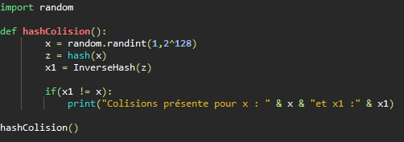

# Le Hachage

## Définition du hachage

Le hachage est un outil de chiffrement permetant de transformer des données diverses en forme abrégée que l'on appel valeur de hachage.
Pour chaque méthode de hachage, les valeurs de hachage sont toujours de la même longueur.
Contrairement au chiffrement une fois les données hachés il n'est pas possible de revenir à la valeur d'origine et non haché.

## Son fonctionnement

Il extiste trois éléments dans le processus de hachage :
  - La fonction de hachage : Il s'agit d'un algorithme quiu transforme des données de longueurs différentes en chaines de longueurs égales
  - Valeur de hachage : Il s'agit du résultat de la fonction de hachage, contrairement à la valeur d'origine elle à toujours la même longueur
  - Les tables de hachage : Les données hachés sont placées dans des bases de données sous forme de tables de hachage. Elles nécessitent beaucoup moins d’espace de données que le stockage des données d’origine.

Le hachage repose sur cinq caractéristiques : 
  - Le déterminisme : la fonction de hachage doit toujours générer une valeur de hachage fixe de longueur courte
  - L'illisibilité :  le hachage transforme les valeurs d’origine en valeurs de hachage qui ne peuvent pas être lues. Il ne doit pas y avoir de moyen de revenir aux données d'origines depuis la valeur hachée.
  - La sécurité en cas de colision : la même valeur de hachage ne peut pas être affectée à des entrées différentes. Si deux valeurs d’origine reçoivent la même valeur de hachage, il s’agit d’une collision.
  - La continuité ou non-continuité :
  - La vitesse : Une fois haché les données à comparer sont plus faibles que les données d'origines.

Une autre propriétée importante est la résistance en préimage, étant donnée une valeurde haché, il doit être difficile de déterminer un message dont l’image par la fonction de hachage soit égale à cette valeur de haché

## L'attaque des anniversaires

Comme nous en avons parlé précédement, une des conditions de sécurité nécessaire porte sur la longueur des empreintes.
Cette condition résulte d'une méthode simple pour obtenir des colisions appelées *attaque des anniversaires*. Ce nom provient du *paradoxe des anniversaires*, qui dit que la probabilité qu'il exise deux personnes partageant la même date d'anniversaire dans une assemblée de 23 personnes aléatoiresest d'au moint 1/2.

Pour prouver cette explication, nous pouvons utiliser la fonction de hachage de Chaum-van Heijst-Pfitzmann. La forumule suivante permet de déterminer à partir de combien d'itérations nous avons 50% de chances de tomber sur le même résultat : 1.17 $\sqrt{n}$, Pour n le nombre de possiblités.

Afin de prouver l'attaque des anniversaires nous allons utiliser ce calcul sur notre exemple d'un groupe de personne. Le calcul sera donc le suivant : 1.17 $\sqrt{365}$

Le résultat est le suivant : $\approx$ 22.352

Pour 23 personnes on sait donc qu'il y a une probabilité de plus de 50% qu'une personne soit née le même jour qu'une autre personne du groupe.

## Les colisions

Nous allons écrire un petit algorithme permettant de chercher des colisions, cependant cette algorithme de cherchera des colisions que parmis des nombres aléatoire.
Cet algorithme à été récupéré dans le livre *Cryptographie Théorie et pratique* de Douglas Stinson

Cependant le code ci-dessus n'a pas de réel interet car l'interet de trouver des données avec le même hash serait des colisions de document afin de les falssifie.
Cette méthode "Brute Force" pouvait fonctionner aupravant avec les anciennes méthodes de hash tel que MD2, MD4, MD5 ou SHA1. Mais pour les méthode actuelles tel que SHA256 ou SHA512 ont des valeurs hachées trop longues pour trouver des colisions.

Un exemple assez flagrant afin d'expliquer pourquoi ces dernières version du hash SHA sont assez robuste, il faudrait 78 256 434 036 333 969 729 345 924 683 144 455 907 années pour générer la totalité des combinaisons du sha256.

## Sources

Livre : *Cryptographie Théorie et pratique* de Douglas Stinson 

Liens : 

[Steemit](https://steemit.com/fr/@peneinc/une-collision-sha256-est-elle-possible-hash-math-blog)

